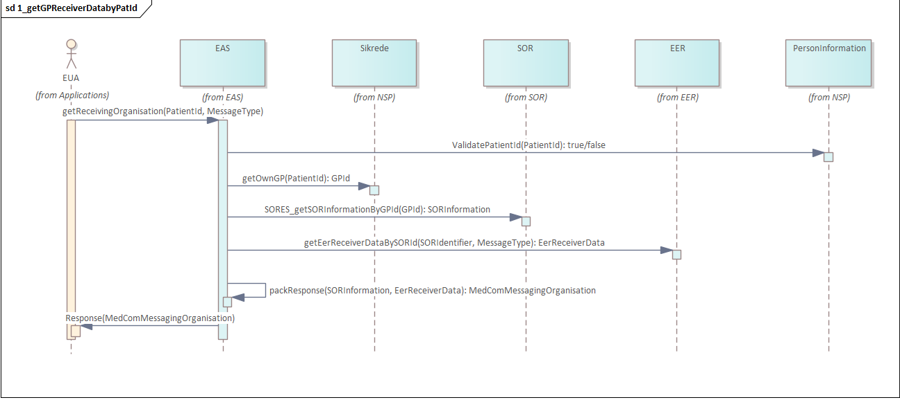
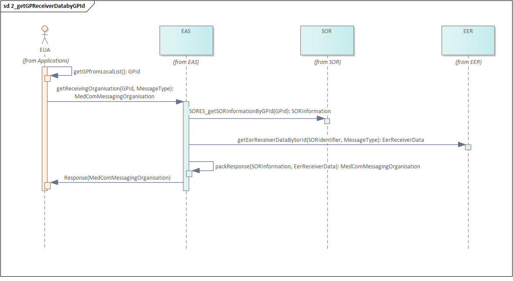
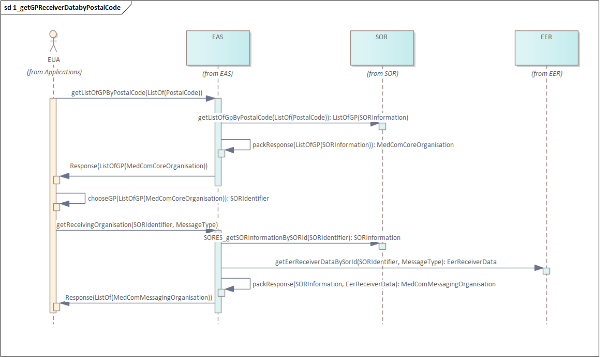
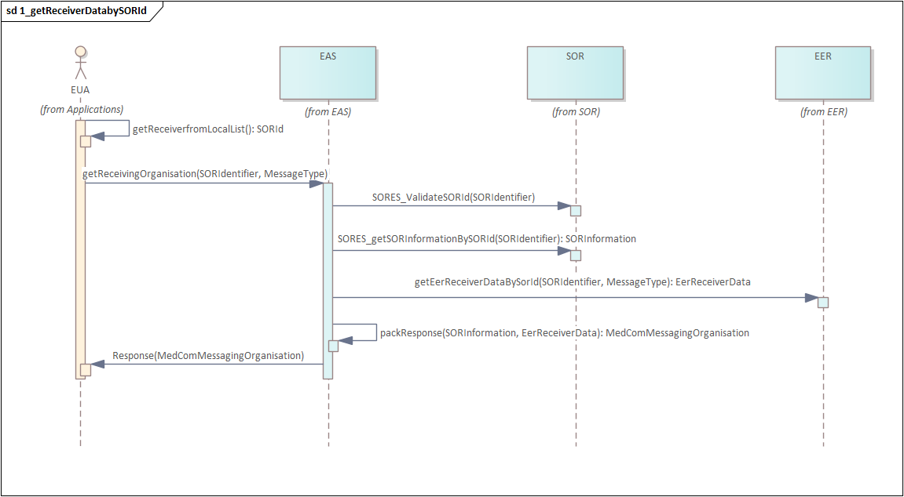
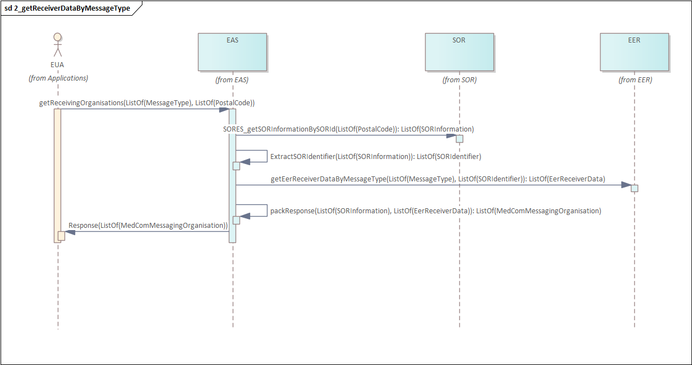

# EHMI Addressing Service (EAS)

 

The EHMI Addressing Service (EAS) Implementation Guide is a Search Profile that defines some basic and reusable search patterns based on the EER Resources. 

EAS will implement searches in authoritative sources like 

- "Sikrede"
- SOR
- EER

In the first version of EAS it will expose these searches for clients in the healthcare domain:

- getGP_SikrGrp1_1_getGPReceiverDatabyPatId
    - GET [EAS-base]/Organization?_profile=http://medcomfhir.dk/ig/messaging/StructureDefinition/medcom-messaging-organization&Patient?Identifier.value=123&system=urn:oid:1.2.208.176.1.2
    - This search will produce a MedComMessagingOrganization as a response
    - EAS will in order to produce this response run through a sequence of calls from 

- getGP_SikrGrp1_1_getGPReceiverDatabyGPId
    - GET [EAS-base]/Organization?_profile=http://medcomfhir.dk/ig/messaging/StructureDefinition/medcom-messaging-organization&Patient?Identifier.value=123&system=urn:oid:1.2.208.176.1.2

 

 

 

## Background searches implemented for "Sikrede"
 
 -

 

<>
 (DA)")

 

